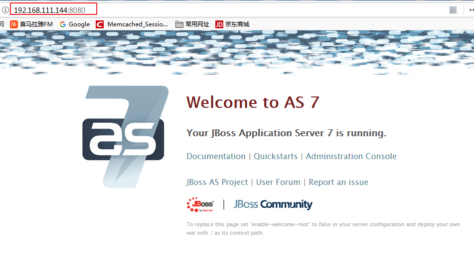

# jboss7.1Final 基础安装


## 环境

版本：ubuntu-server 16.4  
用户：root
apt源：网络源

----------

下载，我们需要下载`jdk`和`jboss7.1`，地址如下：

[http://jbossas.jboss.org/downloads/](http://jbossas.jboss.org/downloads/)

[http://www.oracle.com/technetwork/java/javase/downloads/index.html](http://www.oracle.com/technetwork/java/javase/downloads/index.html)

进入网站，找到需要的版本。
我使用的是jkd7 和 jboss7.1
文件保存在/opt/backup下：

## 安装jdk

将jdk解压，并拷贝到`/opt/portal/`下。改名：`jdk1.7.0_80`

配置环境变量
在`/etc/profile.d`下，创建脚本`java.sh`，内容如下：
```
export JAVA_HOME=/opt/portal/jdk1.7.0_80
export JRE_HOME=$JAVA_HOME/jre
export export CLASSPATH=$CLASSPATH:$JAVA_HOME/lib:$JRE_HOME/lib
export PATH=$JAVA_HOME/bin:$JRE_HOME/bin:$PATH
```

使其生效：`source /etc/profile.d/java.sh`

测试：

```
root@ub3:/opt/portal# java -version
java version "1.7.0_80"
Java(TM) SE Runtime Environment (build 1.7.0_80-b15)
Java HotSpot(TM) 64-Bit Server VM (build 24.80-b11, mixed mode)
```

## jboss的安装

将在`/opt/backup/`中的**jboss**的包解压后拷贝到`/opt/portal/`下并改名 `jboss7_1` :
```
root@ub3:/opt/portal# ll
total 12
drwxr-xr-x 10 root root 4096 Jan 16 16:44 jboss7_1/
drwxr-xr-x  8 root root 4096 Sep 30 18:55 jdk1.7.0_80/
```

配置环境变量
在`/etc/profile.d`下，创建脚本`jboss.sh`，内容如下：
```
export JBOSS_HOME=/opt/portal/jboss7_1
export PATH=$JBOSS_HOME/bin:$PATH
```

使其生效：`source /etc/profile.d/jboss.sh`

## IP绑定

刚安装的jboss是绑定的127.0.0.1，位了能够访问没我们需要重新绑定本机的IP：
在`/opt/portal/jboss7_1/standalone/configuration/`目录下，
打开`standalone.xml`文件，修改如下的IP(一定是自己服务器上的可用IP)：
```
... ...
<interface name="public">
     <inet-address value="${jboss.bind.address:192.168.111.144}"/>
</interface>
... ...
```

## 测试性启动

进入到`/opt/portal/jboss7_1/bin`下（设置了环境变量可以不进），启动服务

```
./standalone.sh 
```

由于是非后台执行，所以我们按下`Ctrl+C`时就会停掉服务。我们启动后输入IP加端口号，可以在浏览器中看到如下内容：




## 一个启动脚本

自编一个启动脚本，如下所示：
```
#!/bin/bash

# this is a footscript of starting jboss

kill_jboss() {
	PID_NUM=`ps uax | grep "jboss7_1" | grep -v "grep" | awk '{print $2}'`
	for i in $PID_NUM;do
		kill -9 $i
	done
}
judge_jboss(){
	error=`/bin/cat /tmp/jboss_error | sed -n '/ERROR/p' | awk '{print $2}'`
        if [[ $error =~ "ERROR" ]];then
            echo "jboss start failed!"
            echo "" > /tmp/jboss_error
            kill_jboss
        else
            echo "jboss is started"
        fi
}

case $1 in
    start)
		/opt/portal/jboss7_1/bin/standalone.sh &> /tmp/jboss_error &
		judge_jboss
		;;
    restart)
		kill_jboss && echo "jboss is stoped"
		/opt/portal/jboss7_1/bin/standalone.sh &> /tmp/jboss_error &
		judge_jboss 
		;;
	stop)
		kill_jboss&& echo "jboss is stoped"
		;;
	*)
		echo "Error"
		;;
esac
```